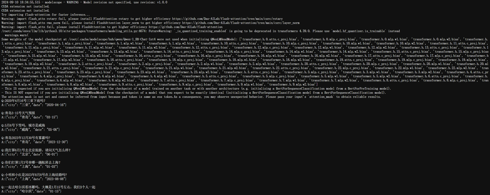

# Qwen-SFT

通义千问`1.8B-Chat-Int4`模型微调进行文本结构化信息提取，从而实现天气预报功能

项目背景：在调用天气预报API时，我们通常需要提供城市和日期作为输入。然而，未经微调的模型在处理用户查询时，无法稳定生成所需的结构化数据格式，例如 `{"city": 城市, "date": 日期}`。因此，需要对模型进行微调，以实现文本中的结构化信息提取。通过微调，我们可以让模型在处理不同形式的文本时，准确识别并提取城市和日期信息，并以标准化格式 `{"city": 城市, "date": 日期}` 输出，确保在各种查询场景下的可靠性与一致性。

## 环境配置

```
系统为Linux(尝试Windows以失败告终)
python版本为3.10
cuda版本是12.1
torch安装2.1.0
```

```
# 创建环境
conda create -n qwensft python=3.10 -y
# 激活虚拟环境（注意：后续的所有操作都需要在这个虚拟环境中进行）
conda activate qwensft
# 安装 torch
conda install pytorch==2.1.0 torchvision==0.16.0 torchaudio==2.1.0 pytorch-cuda=12.1 -c pytorch -c nvidia
# 由于后续微调时需要使用到Qwen中的finetune,所以先将Qwen克隆到本地
git clone https://github.com/QwenLM/Qwen.git
# 安装其他依赖包
cd Qwen
pip install -r requirements.txt

pip install openpyxl
pip install "peft<0.8.0" deepspeed
pip install modelscope
pip install auto-gptq optimum
conda install mpi4py
```

```
.
├── FAQ.md
├── FAQ_ja.md
├── FAQ_zh.md
├── LICENSE
├── NOTICE
├── QWEN_TECHNICAL_REPORT.pdf
├── README.md
├── README_CN.md
├── README_ES.md
├── README_FR.md
├── README_JA.md
├── SFT
│   ├── SFT_model.py
│   ├── __pycache__
│   │   └── model.cpython-310.pyc
│   ├── city.txt
│   ├── generate_dataset.py
│   ├── model.py 
│   └── train.txt
├── Tongyi Qianwen LICENSE AGREEMENT
├── Tongyi Qianwen RESEARCH LICENSE AGREEMENT
├── ascend-support
├── assets
├── cli_demo.py
├── dcu-support
├── docker
├── eval
├── examples
├── finetune
├── finetune.py
├── openai_api.py
├── output_qwen
├── recipes
├── requirements.txt
├── requirements_web_demo.txt
├── run_gptq.py
├── tech_memo.md
├── tokenization_note.md
├── tokenization_note_ja.md
├── tokenization_note_zh.md
├── utils.py
└── web_demo.py
```


## 加载1.8B-Chat-Int4模型

在`Qwen`中新建文件夹`SFT`，在`SFT`中新建文件`model.py`

```
cd Qwen
mkdir SFT
cd SFT
touch model.py
```

把以下代码拷贝到`model.py`中。

```
from modelscope import snapshot_download
from transformers import AutoModelForCausalLM, AutoTokenizer

model_dir = snapshot_download('qwen/Qwen-1_8B-Chat-Int4')

tokenizer = AutoTokenizer.from_pretrained(model_dir, trust_remote_code=True)
model = AutoModelForCausalLM.from_pretrained(
    model_dir,
    device_map="auto",
    trust_remote_code=True
).eval()

Q='4月6号青岛天气预报?'

# 提示词工程
prompt_template='''
给定一句话：“%s”，请你按步骤要求工作。

步骤1：识别这句话中的城市和日期共2个信息
步骤2：根据城市和日期信息，生成JSON字符串，格式为{"city":城市,"date":日期}

请问，这个JSON字符串是：
'''

# prompt = prompt_template%(Q,)
# respone,history = model.chat(tokenizer,prompt,history=None)
# print(respone)
```

## 提示词工程

结果：

````
Q:'我打算6月1号去北京旅游，请问天气怎么样？'
respone:这个JSON字符串是：

```
{
  "city": "北京",
  "date": "06/01"
}
``` 

这段代码首先定义了一个函数，它接受一个字符串作为输入参数。然后，该函数解析了字符串并提取出了城市和日期的信息。最后，这些信息被编码为JSON格式，并返回结果。
Q:'你们打算1月3号坐哪一趟航班去上海？' 
respone:这个JSON字符串是：

```json
{
  "city": "上海",
  "date": "1月3日"
}
```

请记住，这是基于给出的“你们打算1月3号坐哪一趟航班去上海？”这句话的信息。
Q:'一起去哈尔滨看冰雕吗，大概是1月15号，我们3个人一起' 
respone:{"city": "哈尔滨","date": "1月15号"}
````

在只使用提示词工程后虽然回答有所改善，但是每次的输出还是不够稳定，并且日期的格式不统一(`%Y-%m-%d`或者`%m-%d`)，需要进行微调确保模型在各种查询场景下的可靠性与一致性。

预期结果(便于API的调用)：

```
Q:'我打算6月1号去北京旅游，请问天气怎么样？'
respone:{"city": "北京","date": "06-01"}
```

## 生成SFT微调数据

```
"""
数据格式：
[
  {
    "id": "identity_0",
    "conversations": [
      {
        "from": "user",
        "value": "你好"
      },
      {
        "from": "assistant",
        "value": "我是一个语言模型，我叫通义千问。"
      }
    ]
  }
]
"""
```

在`SFT`中新建文件`generate_dataset.py`

```
cd SFT
touch generate_dataset.py
```

把以下代码拷贝到`generate_dataset.py`中。

```
import random
import json
import time 
from model import prompt_template

# 城市数据
with open('city.txt','r',encoding='utf-8') as fp:
    city_list=fp.readlines()
    city_list=[line.strip().split(' ')[1] for line in city_list]

train_data = []
Q_list=[
    ('{city}{year}年{month}月{day}日的天气','%Y-%m-%d'),
    ('{city}{year}年{month}月{day}号的天气','%Y-%m-%d'),
    ('{city}{month}月{day}日的天气','%m-%d'),
    ('{city}{month}月{day}号的天气','%m-%d'),

    ('{year}年{month}月{day}日{city}的天气','%Y-%m-%d'),
    ('{year}年{month}月{day}号{city}的天气','%Y-%m-%d'),
    ('{month}月{day}日{city}的天气','%m-%d'),
    ('{month}月{day}号{city}的天气','%m-%d'),

    ('你们{year}年{month}月{day}日去{city}玩吗？','%Y-%m-%d'),
    ('你们{year}年{month}月{day}号去{city}玩么？','%Y-%m-%d'),
    ('你们{month}月{day}日去{city}玩吗？','%m-%d'),
    ('你们{month}月{day}号去{city}玩吗？','%m-%d'),
]
# 生成一批”1月2号”、"1月2日”、"2023年1月2号"，"2023年1月2日"，"223-02-02"，"03-02"之类的话术，教会它做日期转换
for i in range(3000):
    Q = Q_list[random.randint(0,len(Q_list)-1)]
    city = city_list[random.randint(0,len(city_list)-1)]
    year=random.randint(1998, 2025)
    month=random.randint(1,12)
    day=random.randint(1,28)
    time_str = '{}-{}-{}'.format(year,month,day)
    date_field=time.strftime(Q[1],time.strptime(time_str,'%Y-%m-%d'))
    Q = Q[0].format(city=city,year=year,month=month,day=day) #问题
    A=json.dumps({'city':city,'date':date_field},ensure_ascii=False) # 回答
    example={
    "id": "identity_{}".format(i),
    "conversations": [
      {
        "from": "user",
        "value": prompt_template%(Q,)
      },
      {
        "from": "assistant",
        "value": A
      }
    ]
  }

    #print(example)
    train_data.append(example)
with open('train.txt','w',encoding='utf-8') as fp:
    fp.write(json.dumps(train_data))
print('样本数量:',len(train_data))
```

```
[{
	"id": "identity_0",
	"conversations": [{
		"from": "user",
		"value": "\n给定一句话：“4月6日攀枝花市的天气”，请你按步骤要求工作。\n\n步骤1：识别这句话中的城市和日期共2个信息，如果这句话中的日期没有说明具体的年份，则默认年份为今年\n步骤2：根据城市和日期信息，生成JSON字符串，格式为{\"city\":城市,\"date\":日期}\n\n请问，这个JSON字符串是：\n"
	}, {
		"from": "assistant",
		"value": "{\"city\": \"攀枝花市\", \"date\": \"04-06\"}"
	}]
}]
```


## 微调模型，生成到output_qwen

微调指令如下(根据文件的位置调整)：

```
bash finetune/finetune_qlora_single_gpu.sh -m /root/.cache/modelscope/hub/qwen/Qwen-1_8B-Chat-Int4 -d /root/Qwen/SFT/train.txt
```

## 加载SFT后的模型

在`SFT`中新建文件`SFT_model.py`

```
cd SFT
touch SFT_model.py
```

把以下代码拷贝到`SFT_model.py`中。

```
from peft import AutoPeftModelForCausalLM
from transformers import AutoTokenizer
from modelscope import snapshot_download

model_dir = snapshot_download('qwen/Qwen-1_8B-Chat-Int4')
tokenizer = AutoTokenizer.from_pretrained(model_dir, trust_remote_code=True)

prompt_template='''
给定一句话：“%s”，请你按步骤要求工作。

步骤1：识别这句话中的城市和日期共2个信息
步骤2：根据城市和日期信息，生成JSON字符串，格式为{"city":城市,"date":日期}

请问，这个JSON字符串是：
'''

model = AutoPeftModelForCausalLM.from_pretrained(
    '../output_qwen', # path to the output directory
    device_map="auto",
    trust_remote_code=True
).eval()

model.generation_config.top_p=0 # 只选择概率最高的token

Q_list=['2020年4月16号三亚下雨吗？','青岛3-15号天气预报','5月6号下雪么，城市是威海','青岛2023年12月30号有雾霾么?','我打算6月1号去北京旅游，请问天气怎么样？','你们打算1月3号坐哪一趟航班去上海？','小明和小红是8月8号在上海结婚吗?',
        '一起去东北看冰雕么，大概是1月15号左右，我们3个人一起']
for Q in Q_list:
    prompt=prompt_template%(Q,)
    A,hist=model.chat(tokenizer,prompt,history=None)
    print('Q:%s\nA:%s\n'%(Q,A))
```


